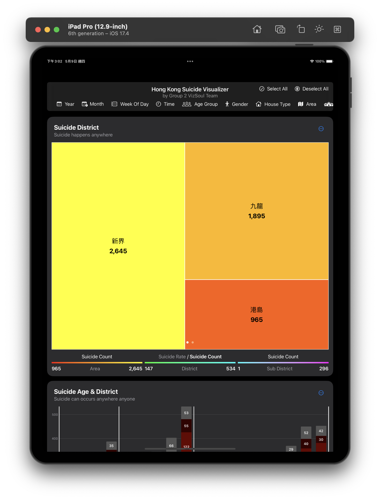
# Hong Kong Suicide Visualizer
An app that displays Hong Kong suicide statistics, including:
- [Suicide District](#suicide-district)
- [Suicide Age and District](#suicide-age--district)
- Suicide Category & House Type & District
- [Suicide Age Group & Reason](#suicide-age-group--reason)
- [Suicide Category & Status](#suicide-category--status)
- [Suicide Period](#suicide-period)
- [Suicide Time](#suicide-time)

## Suicide District
A tree map that shows suicide count across hierarchical geometric level
| Features | Result |
| --- | --- |
| Switching Granularity | 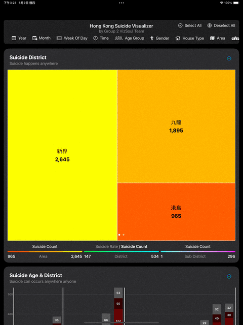 |
| Showing Percentage | 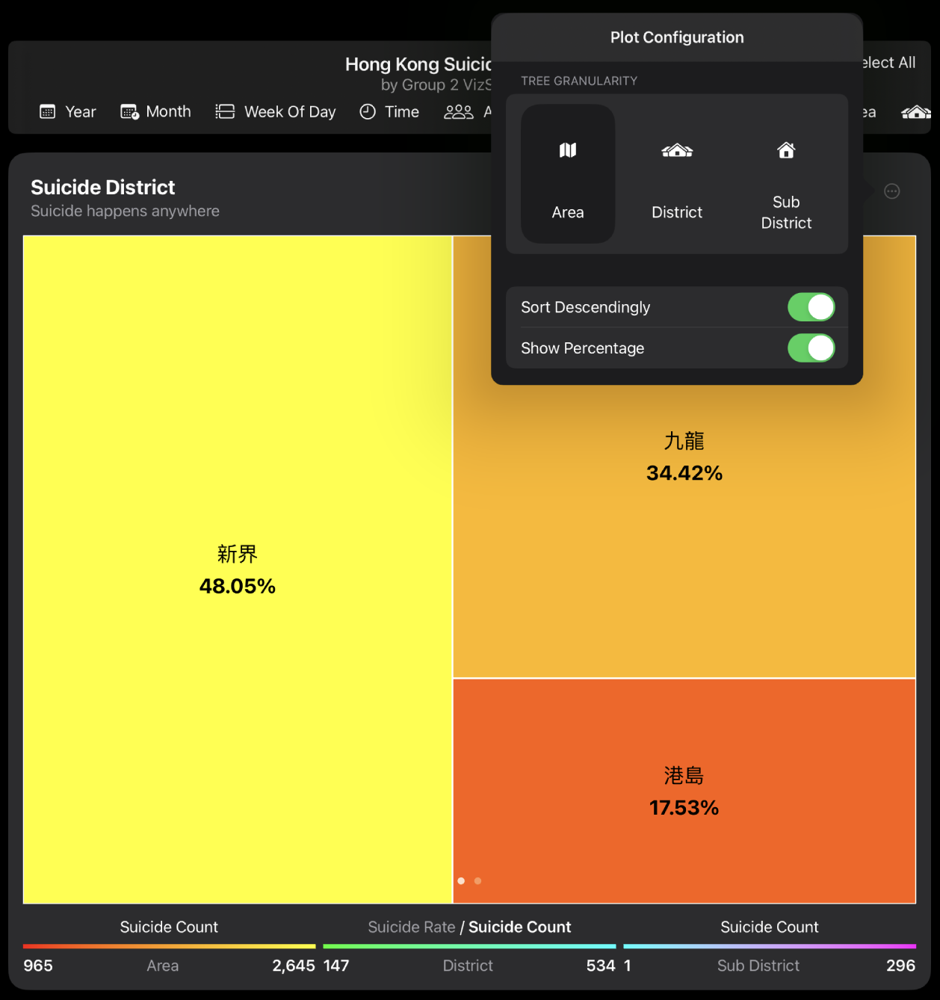 |
| Sorting | 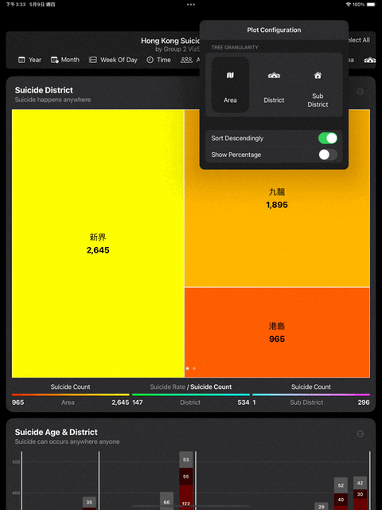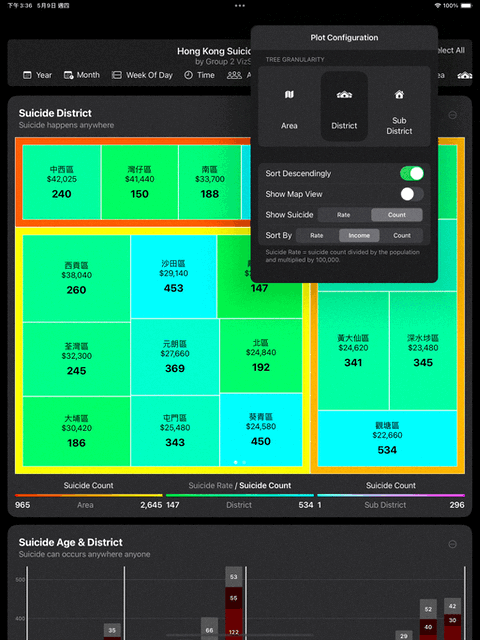  |
| Map View | 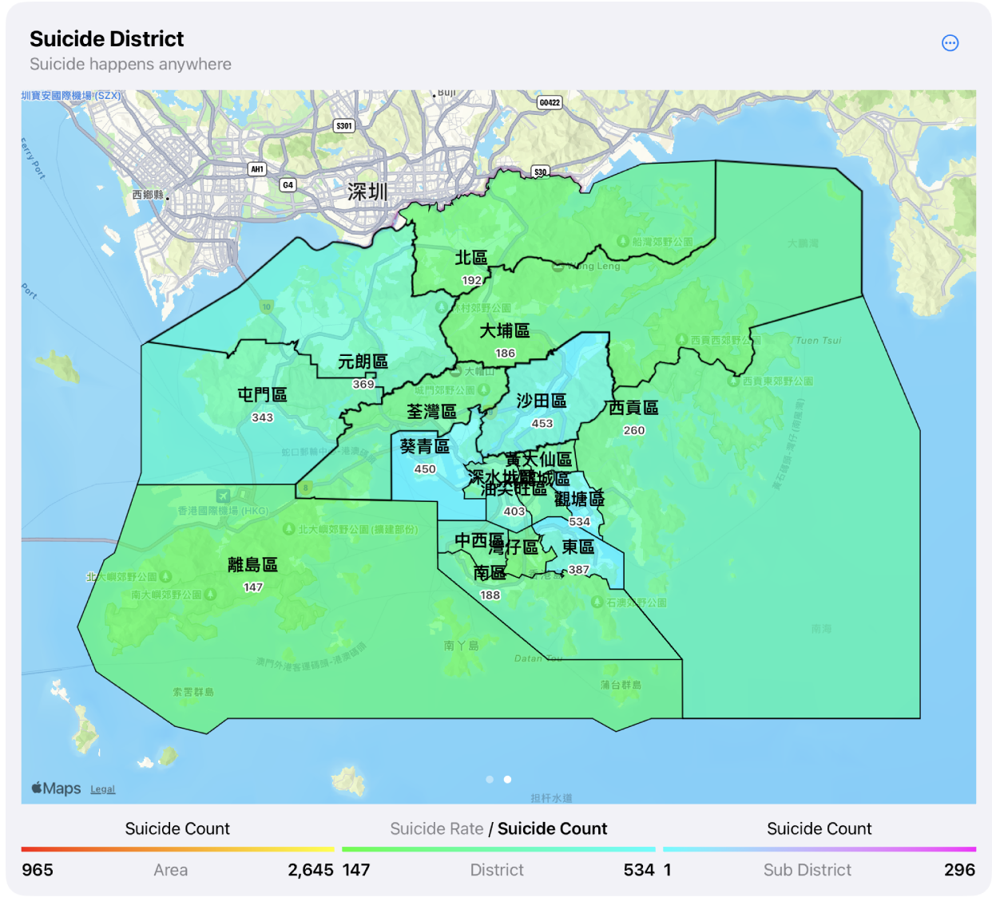 |
| Showing Suicide Rate Or Count | 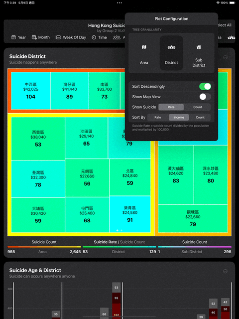  Notice the legend changes accordingly |
| Sort By Suicide Rate/Count or District Income | 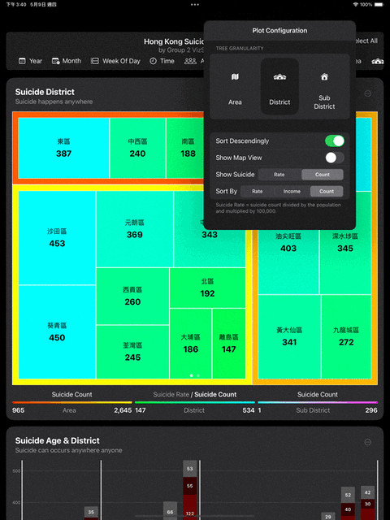 |

Note: We follow the definition from [WHO](https://www.who.int/data/gho/indicator-metadata-registry/imr-details/4664#:~:text=Definition%3A,and%20multiplied%20by%20100%20000) to calculate the Suicide Rate = Suicide Count / District Population * 100,000

🔦 **Idiom**:
- `Overview First, Zoom and Filter, Detail on Demand`: We show the area level information (overview) first. If users are interested in detail, they can pinch to zoom, or toggle the picker in config to switch granularity. This ensure that users are not overwhelmed.

🎨 **Color Scheme**:
- `Sequential Color Scale`: We divide the whole color spectrum into 3 parts, each corresponds to a geometric granularity:
    - Level `Area`: Red to yellow
    - Level `District`: green to cyan
    - Level `Sub District`: blue to purple

## Suicide Age & District
A stacked bar chart that shows suicide count across age groups and districts

| Features | Result |
| --- | --- |
| Show Percentage |  |
| Sort Within District or Globally |  |
| Sort Ascendingly or Descendingly | 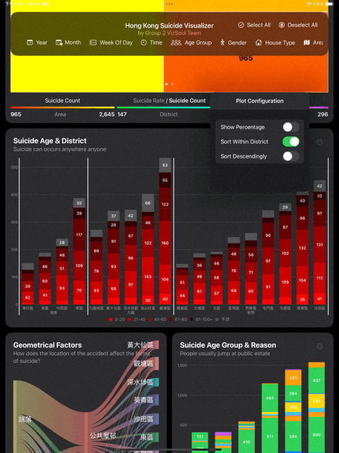 |
| Tooltip | 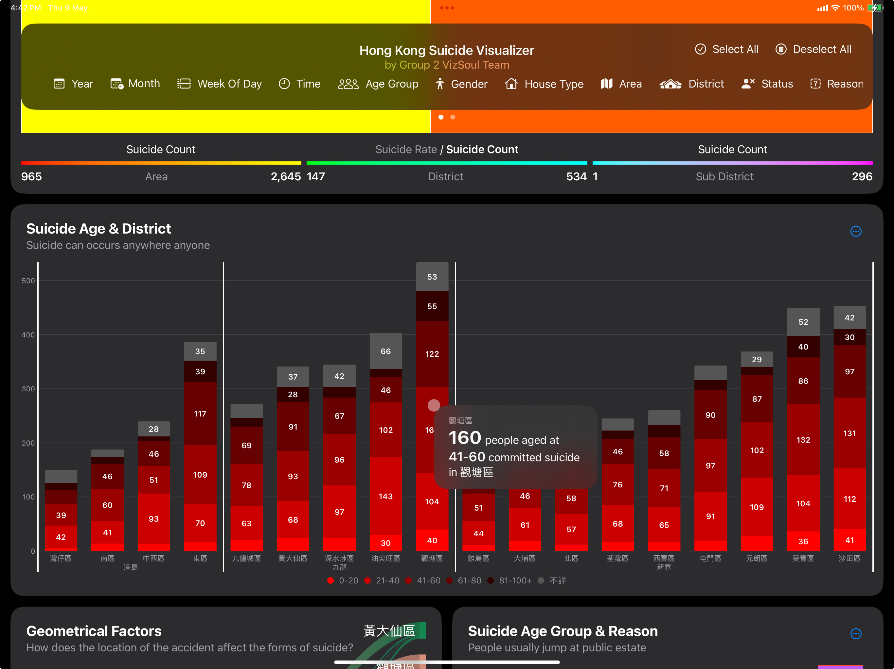 |

🔦 **Idiom**:
- `Change order/arrangement`: Support flexible comparison, trend, extreme values.
- `Animated transitions`: Smooth transition from one state to another to reduce cognitive load

🎨 **Color Scheme**:
- `Sequential Color Scale`: enforce ordering in terms of suicide count
- Align with our daily convention that the color of red symbolise death or something caution, matching the nature of suicide

## Suicide Age Group & Reason
A stacked bar chart showing the relationship between age group and suicide reason

| Features | Result |
| --- | --- |
| Show Percentage | 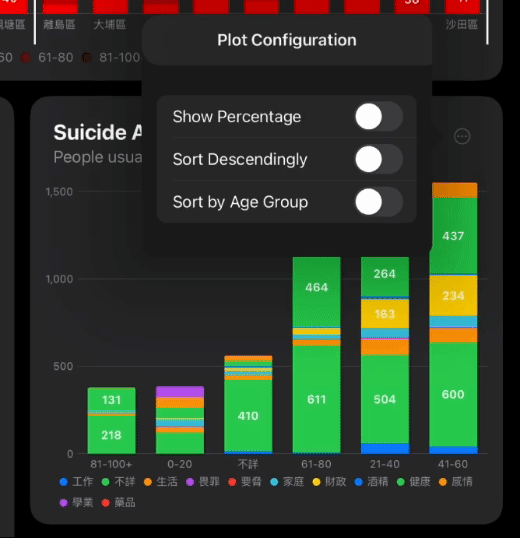 |
| Sort Ascendingly or Descendingly |  |
| Sort By Age Group | 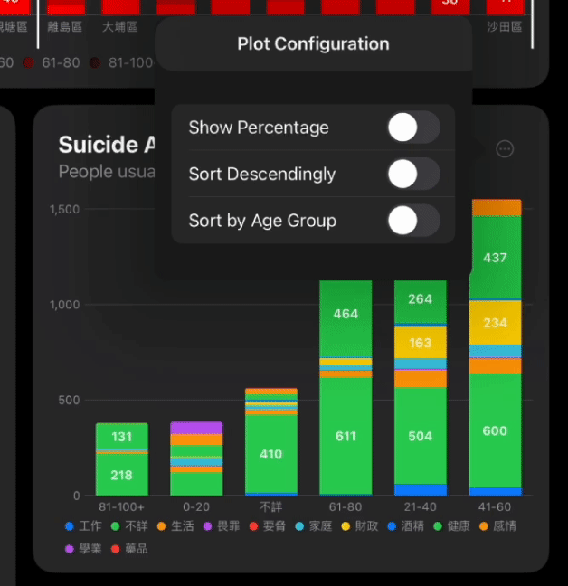 |

## Suicide Category & Status
A stacked bar chart showing the relationship between suicide category and suicide status

| Features | Result |
| --- | --- |
| Show Percentage |  |
| Sort Ascendingly or Descendingly |  |

## Suicide Period
A heatmap showing the suicide period distribution

| Features | Result |
| --- | --- |
| Overview | 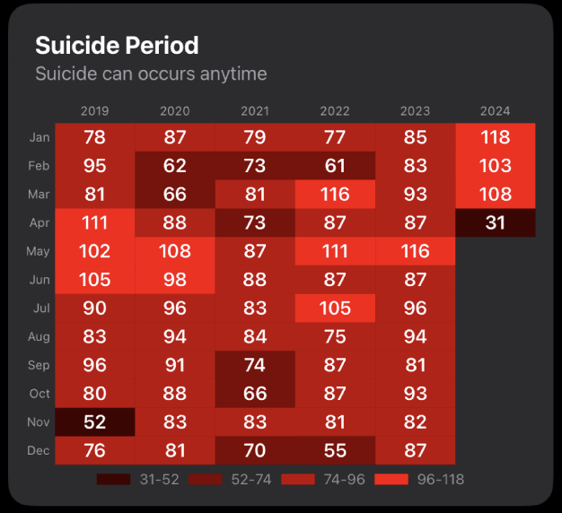 |
| Tooltip | 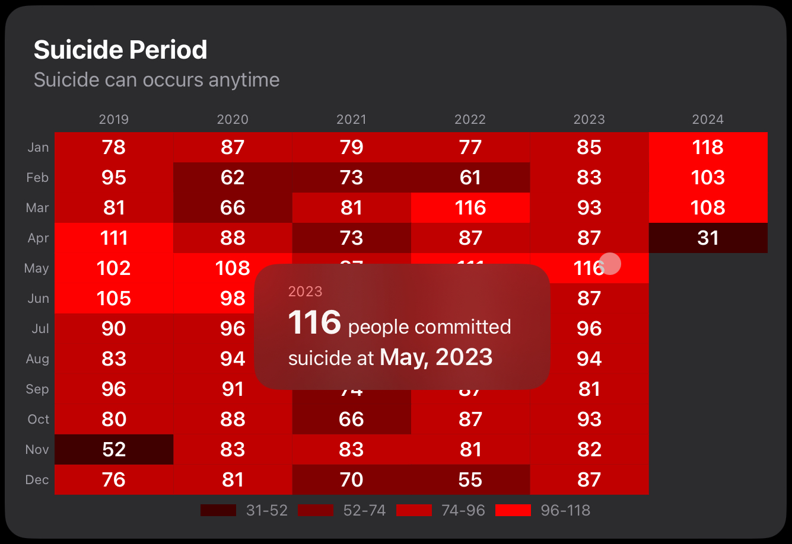 |

## Suicide Time
A heatmap showing the suicide time distribution
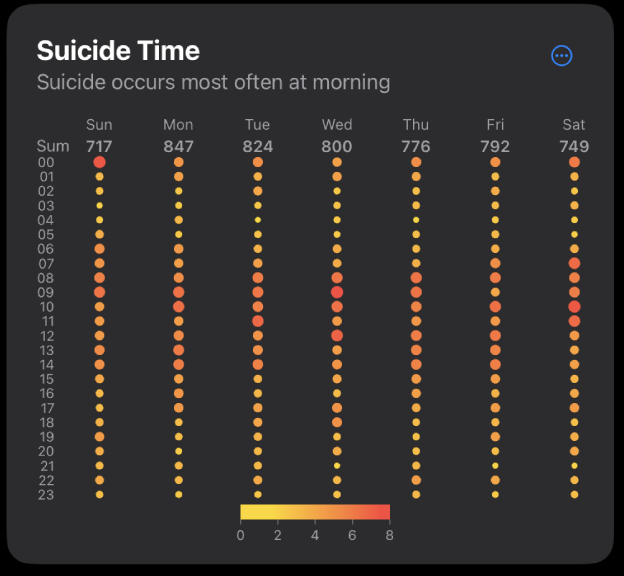
